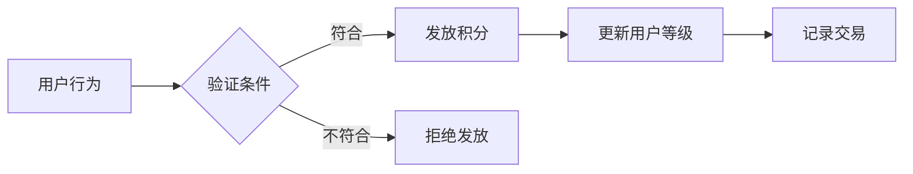
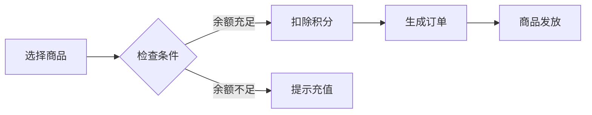
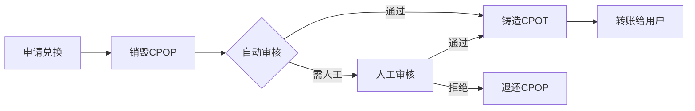

# CPOP积分系统产品设计方案

## 项目概述

CPOP积分系统是一个基于Web3技术的全场景积分生态，旨在打造用户友好的积分获取、消费和价值转换平台。系统采用创新的账户抽象技术，为用户提供类似Web2的丝滑体验，同时保持Web3的去中心化优势。

## 🎯 产品定位

### 核心价值主张
- **零门槛Web3体验**：用户无需理解钱包、私钥等复杂概念
- **完整积分生态**：从获取到消费的全场景覆盖
- **真实价值转换**：积分可转换为真金白银，不是空气
- **传统消费场景**：支持MasterCard日常消费，打通线上线下

## 🏗️ 系统架构

### 整体架构图

```
┌─────────────────┐    ┌─────────────────┐    ┌─────────────────┐    ┌─────────────────┐
│   APP用户界面    │    │   积分获取系统   │    │   链下商城系统   │    │   U卡充值系统   │
└─────────────────┘    └─────────────────┘    └─────────────────┘    └─────────────────┘
         │                       │                       │                       │
         └───────────────────────┼───────────────────────┼───────────────────────┘
                                 │                       │
         ┌─────────────────────────────────────────────┐ │
         │              CPOP核心层                    │ │
         │  ┌─────────────┐  ┌─────────────┐  ┌────────┐ │ │
         │  │CPOPToken   │  │AAWallet     │  │Paymaster│ │ │
         │  │积分代币      │  │账户抽象      │  │Gas代付  │ │ │
         │  └─────────────┘  └─────────────┘  └────────┘ │ │
         └─────────────────────────────────────────────┘ │
                                 │                       │
         ┌───────────────────────────────────────────────────────────────────────┐ │
         │                           应用层合约                              │ │
         │  ┌─────────┐  ┌─────────┐  ┌─────────┐  ┌─────────┐  ┌─────────────┐  │ │
         │  │Activity │  │Consumer │  │Recharge │  │UCardRec │  │Exchange     │  │ │
         │  │任务活动  │  │积分消费  │  │积分充值  │  │U卡记录  │  │CPOT兑换     │  │ │
         │  └─────────┘  └─────────┘  └─────────┘  └─────────┘  └─────────────┘  │ │
         └───────────────────────────────────────────────────────────────────────┘ │
                                 │                       │
         ┌─────────────────────────────────────────────┐ │
         │              链下服务层                      │ │
         │  ┌─────────┐  ┌─────────┐  ┌─────────────┐  │ │
         │  │商品管理  │  │订单处理  │  │物流服务     │  │ │
         │  │服务     │  │服务     │  │             │  │ │
         │  └─────────┘  └─────────┘  └─────────────┘  │ │
         └─────────────────────────────────────────────┘ │
                                 │                       │
         ┌─────────────────────────────────────────────────────────────────────┐
         │                      金融服务层                                      │
         │  ┌─────────────┐  ┌─────────────┐  ┌─────────────┐  ┌─────────────┐  │
         │  │U卡管理系统  │  │支付网关     │  │风控系统     │  │清算系统     │  │
         │  │(MasterCard) │  │服务        │  │             │  │             │  │
         │  └─────────────┘  └─────────────┘  └─────────────┘  └─────────────┘  │
         └─────────────────────────────────────────────────────────────────────┘
                                 │
                    ┌─────────────────┐
                    │   CPOT代币      │
                    │  (HZToken.sol)  │
                    │   外部流通       │
                    └─────────────────┘
```

### 双代币体系设计

```
┌─────────────────┐     ┌─────────────────┐
│      CPOT       │────▶│     CPOP       │
│   (外部代币)     │     │   (内部积分)     │
│                 │◀────│                 │
│ • 可自由交易     │     │ • 仅内部流通     │
│ • 在交易所买卖   │     │ • APP内消费      │
│ • 有投资价值     │     │ • 用户获得奖励   │
└─────────────────┘     └─────────────────┘
```

### 系统分层架构

#### 核心层 (CPOP Core)
- **CPOPToken**: 积分代币合约，轻量化ERC20实现
- **CPOPAAWallet**: 账户抽象钱包，支持社交恢复
- **CPOPPaymaster**: Gas费代付系统

#### 应用层 (Application Layer)  
- **CPOPActivity**: 任务活动系统，处理积分获取
- **CPOPConsumer**: 通用积分消费合约
- **CPOPRecharge**: CPOT充值系统，处理代币转换
- **CPOPUCardRecords**: U卡记录系统，处理所有U卡相关记录上链
- **CPOPExchange**: CPOT兑换系统，处理提现申请

#### 服务层 (Service Layer)
- **链下服务层**: 商品管理、订单处理、物流服务
- **金融服务层**: U卡管理、支付网关、风控系统、清算系统

### 核心设计原则

#### 1. 内外分离
- CPOP专注于APP内积分经济
- CPOT面向外部价值交换
- 通过审核机制连接两个体系

#### 2. 用户体验优先
- 账户抽象消除私钥管理复杂性
- Gas代付降低使用门槛
- 批量操作提升效率

#### 3. 安全可控
- 多级权限管理
- 白名单转账限制
- 社交恢复机制
- 每日消费限额

#### 4. 可扩展性
- 模块化合约设计
- 可升级合约架构
- 灵活的插件机制

#### 5. 透明可追溯
- 所有U卡交易记录完全上链
- 敏感信息加密存储保护隐私
- 支持完整的交易历史查询
- 内置AML监控满足合规要求
- 数据完整性和防篡改保证

**设计理念**：
- CPOT作为对外价值载体，可在交易所交易
- CPOP作为内部积分，确保用户留存和活跃
- 双向转换机制，满足不同用户需求

## 🔥 核心功能

### 1. 账户抽象技术优势

#### 传统Web3 vs 我们的方案

| 对比维度 | 传统Web3钱包 | CPOP账户抽象 |
|---------|-------------|--------------|
| **用户门槛** | 需要理解私钥、助记词 | 手机号/邮箱即可注册 |
| **Gas费用** | 用户需要持有ETH | 系统代付，用积分抵扣 |
| **账户恢复** | 丢失助记词=永久丢失 | 社交恢复，联系客服找回 |
| **操作复杂度** | 每次操作都要签名确认 | 批量操作，一次确认多个动作 |
| **用户体验** | 等待区块确认 | 链下预处理，即时响应 |

#### 实际用户体验
```
传统方式：
1. 下载MetaMask → 2. 创建钱包 → 3. 备份助记词 → 4. 购买ETH → 5. 连接DApp → 6. 签名交易 → 7. 等待确认

我们的方式：
1. 手机号注册 → 2. 开始使用 ✅
```

### 2. 积分获取体系

#### 免费获取渠道
- **每日签到**：基础积分保障，连续签到奖励递增
- **任务系统**：新手任务、日常任务、特殊活动任务
- **推荐奖励**：邀请好友获得双方奖励
- **社区活动**：参与官方活动获得限时奖励

#### CPOT充值获取 (Recharge模块)
- **基础兑换**：1 CPOT = 1000 CPOP (1:1000比例)
- **充值门槛**：最小充值100 CPOT起充
- **充值费用**：无手续费，鼓励用户参与
- **处理时效**：实时到账，无需等待确认
- **安全控制**：
  - 每日限额：单用户最大充值100,000 CPOT/日
  - 总量控制：系统设置充值总量上限
  - 紧急暂停：管理员可暂停充值功能
  - 白名单验证：仅允许合规用户参与充值

**充值技术实现流程**：
```
1. 用户授权CPOT → Recharge合约
2. 调用充值接口，指定充值数量
3. 验证CPOT余额和授权额度
4. 从用户账户转移CPOT到合约
5. 销毁接收到的CPOT代币
6. 按1:1000比例铸造CPOP积分到用户账户
7. 触发充值成功事件
8. 更新用户积分余额和等级
```

**充值示例**：
```
用户充值100 CPOT：
• 基础获得：100,000 CPOP (1:1000)
• 处理费用：0 CPOT (免费)
• 总计：100,000 CPOP

用户充值1,000 CPOT：
• 基础获得：1,000,000 CPOP (1:1000)
• 处理费用：0 CPOT (免费)
• 总计：1,000,000 CPOP
```

### 3. 消费场景矩阵

#### 线上消费
- **积分商城**：实物商品、虚拟道具、会员权益
- **付费服务**：高级功能解锁、专属内容访问
- **Gas费代付**：所有区块链操作费用用积分支付

#### 线下消费 - U卡系统
- **MasterCard虚拟卡**：积分充值后全球通用
- **实体卡支持**：可申请实体卡片
- **实时消费**：超市、餐厅、加油站等日常消费
- **消费记录**：完整的消费历史追踪

**U卡使用流程**：
```
1. 用户在APP内申请U卡
2. 用积分充值到U卡（实时汇率转换为美元）
3. 获得MasterCard卡号
4. 在任何支持MasterCard的地方消费
5. 消费从卡余额扣除，无需额外手续费
```

### 4. 用户成长体系

#### 等级系统
- **等级范围**：1-100级
- **升级条件**：基于累计获得积分
- **等级权益**：
  - 充值奖励加成
  - 专属商品访问权
  - 客服优先响应
  - 特殊活动邀请

#### VIP系统
- **获得方式**：充值达到一定金额或特殊活动
- **VIP特权**：
  - 所有充值额外5%奖励
  - VIP专属商品
  - 专属客服通道
  - 提前体验新功能


---

## 🎯 结论

CPOP积分系统通过创新的账户抽象技术，解决了Web3产品用户体验差的核心痛点。完整的双代币体系设计既保证了用户留存，又提供了真实的价值转换通道。特别是U卡系统的创新，将数字积分与传统消费场景无缝连接，为用户创造了真正的使用价值。

在正确的产品策略和技术实现的支撑下，我们有信心打造出下一代积分系统的标杆产品，引领行业向更好的用户体验方向发展。

---

## 💳 U卡交易记录系统

### 产品概述

U卡交易记录系统是CPOP积分系统的重要组成部分，确保所有U卡相关的交易都能被完整记录和追溯，为用户提供透明可信的交易历史，同时满足金融监管和合规要求。

### 核心价值

#### 🔍 **完全透明**
- 所有U卡交易记录完全上链，确保透明性
- 用户可随时查询完整的交易历史
- 支持第三方审计和验证

#### 🛡️ **隐私保护**
- 敏感信息加密存储，保护用户隐私
- 商户信息脱敏处理
- 符合数据保护法规要求

#### 📊 **合规支持**
- 满足金融监管要求
- 支持反洗钱(AML)监控
- 自动生成合规报告

### 功能特性

#### 记录类型
- **充值记录**: CPOP积分充值到U卡的完整记录
- **消费记录**: U卡在线上线下的所有消费记录
- **提现记录**: U卡余额提现的详细记录
- **余额变动**: 所有影响U卡余额操作的汇总记录

#### 消费分类
- **线上消费**: 电商购物、数字服务等
- **线下消费**: 实体店刷卡、ATM取现等
- **订阅服务**: 会员费、订阅费等定期支付
- **转账服务**: 用户间转账、汇款等
- **退款处理**: 商品退款、服务退费等

#### 状态管理
- **待处理**: 交易已发起，等待处理
- **成功**: 交易已成功完成
- **失败**: 交易处理失败
- **已取消**: 交易被用户或系统取消

### 用户体验

#### 📱 **实时查询**
- APP内实时查看交易记录
- 按时间、类型、金额等维度筛选
- 支持导出交易账单

#### 🔔 **智能通知**
- 交易完成即时通知
- 异常交易预警提醒
- 月度账单自动生成

#### 📈 **数据分析**
- 个人消费分析报告
- 支出类别统计图表
- 消费趋势分析

### 安全机制

#### 数据安全
- 多重加密保护用户隐私
- 访问权限严格控制
- 定期安全审计和检查

#### 防欺诈
- 异常交易自动识别
- 大额交易二次确认
- 风险交易实时拦截

#### 合规监控
- 自动AML合规检查
- 可疑交易自动标记
- 监管报告自动生成

### 业务价值

#### 对用户
- **透明可信**: 每笔交易都有完整记录
- **便于管理**: 清晰的消费账目管理
- **安全保障**: 多重安全机制保护

#### 对平台
- **合规运营**: 满足金融监管要求
- **风险控制**: 实时监控异常交易
- **数据洞察**: 用户行为分析支持

#### 对监管
- **完整审计**: 所有交易记录可追溯
- **合规报告**: 自动生成监管报告
- **透明运营**: 运营数据公开透明

---

## 🔧 技术特性详解

### EIP-4337 账户抽象
- **EntryPoint**: 统一的入口合约，处理所有用户操作
- **UserOperation**: 用户操作的标准化数据结构
- **Paymaster**: 支持积分支付Gas费，提升用户体验
- **Bundler**: 批量处理用户操作，优化网络效率

### 智能合约架构
- **可升级设计**: 基于OpenZeppelin的UUPS代理模式
- **权限管理**: 基于角色的访问控制(RBAC)
- **模块化设计**: 各模块独立部署，职责清晰
- **事件驱动**: 完整的事件体系，支持链下监控

### 积分经济模型
- **多源获取**: 支持6种不同的积分获取方式
- **动态奖励**: 基于用户等级和活动的奖励倍数
- **消费场景**: 商城购物、Gas费支付、特权服务
- **通胀控制**: 每日获取限额，防止积分通胀

## 📋 完整业务流程

### 积分获取流程

#### 免费获取流程图


#### CPOT充值获取流程
```
用户持有CPOT → 申请充值兑换 → 销毁CPOT代币 → 铸造CPOP积分 → 立即可用消费
```

### 积分消费流程

#### 线上消费流程图  


#### 线上消费详细流程
```
用户选择商品(链下) → 检查库存余额(混合) → 创建订单(链下) → 销毁积分(链上) → 履约发货(链下)
```

#### U卡充值消费流程
```
积分充值到U卡(链上) → 记录充值信息(链上) → 生成虚拟卡余额(金融服务) → 日常刷卡消费(传统支付) → 记录消费信息(链上) → 定期清算对账(链下)
```

### 兑换提现流程

#### 兑换流程图


#### 兑换流程详细说明
```
申请兑换 → 销毁CPOP → 多级审核 → 铸造CPOT → 转账到用户钱包
```

## 🛡️ 安全机制详解

### 智能合约安全
- **重入攻击防护**: 使用ReentrancyGuard修饰符
- **溢出保护**: 使用SafeMath或Solidity 0.8+内置保护
- **权限校验**: 严格的角色和权限检查
- **输入验证**: 所有外部输入都进行验证

### 业务安全
- **白名单机制**: CPOP只能在授权合约间转移
- **每日限额**: 防止积分异常获取和消费
- **审核机制**: 大额兑换需要人工审核
- **暂停功能**: 紧急情况下可暂停系统

### U卡记录安全
- **数据加密**: U卡ID和敏感信息使用AES-256加密存储
- **访问控制**: 基于角色的权限管理，用户只能访问自己的记录
- **隐私保护**: 商户信息和账户信息通过哈希处理
- **数据完整性**: 使用Merkle树和数字签名验证记录完整性
- **防篡改**: 记录一旦创建不可修改，只能更新状态
- **合规监控**: 实现AML监控，异常交易自动标记

## 🔗 与现有系统集成

### HZToken集成点
- **兑换桥接**: CPOP → CPOT的转换机制
- **审核系统**: 利用HZToken的权限管理
- **安全机制**: 复用黑名单、暂停等功能

### 部署策略
1. **阶段一**: 部署核心CPOP合约和CPOPConsumer
2. **阶段二**: 集成账户抽象功能和Gas代付
3. **阶段三**: 部署U卡记录系统和链下商城服务
4. **阶段四**: 上线完整的活动系统和积分获取功能
5. **阶段五**: 开启CPOT兑换功能和完整生态运行


---

**注意**: 本系统目前处于开发阶段，请在生产环境使用前进行充分测试和安全审计。

这个完整的产品设计确保了CPOP积分系统的完整性、安全性和可扩展性，为用户提供优质的Web3积分体验。