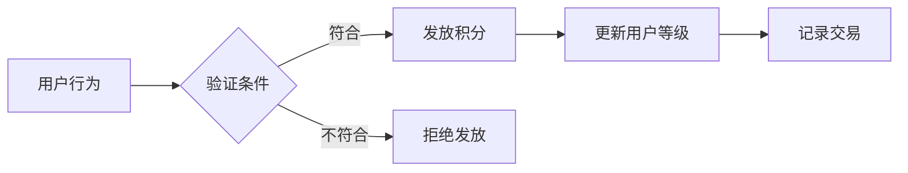
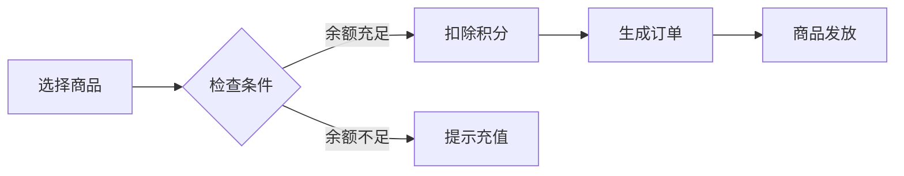
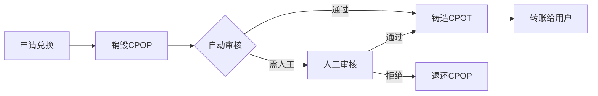

# CPOP积分系统文档

## 概述

CPOP积分系统是一个基于以太坊账户抽象(EIP-4337)的完整积分生态系统，与现有CPOT代币(HZToken.sol)形成互补的双代币体系，实现内外循环分离的设计理念。

## 文档结构

- **[ARCHITECTURE.md](./ARCHITECTURE.md)** - 系统架构设计和技术方案
- **[CONTRACTS.md](./CONTRACTS.md)** - 详细的合约设计和接口说明  
- **[DEPLOYMENT.md](./DEPLOYMENT.md)** - 部署指南和配置说明
- **[SECURITY.md](./SECURITY.md)** - 安全机制和审计要点
- **[API.md](./API.md)** - 前端集成API接口文档

## 快速开始

### 系统组成

```
CPOP积分系统
├── 核心层
│   ├── CPOPToken - 积分代币合约
│   ├── CPOPAAWallet - 账户抽象钱包
│   └── CPOPPaymaster - Gas费代付
├── 应用层  
│   ├── CPOPActivity - 任务活动系统
│   ├── CPOPConsumer - 通用积分消费
│   ├── CPOPRecharge - CPOT充值系统
│   └── CPOPExchange - CPOT兑换系统
├── 链下服务层
│   ├── 商品管理服务 - 商城商品和库存
│   ├── 订单处理服务 - 订单创建和跟踪
│   └── 物流服务 - 发货和配送
├── 金融服务层
│   ├── U卡管理系统 - MasterCard虚拟/实体卡
│   ├── 支付网关服务 - 积分充值和汇率转换
│   ├── 风控系统 - 异常检测和风险控制
│   └── 清算系统 - 交易对账和结算
└── 外部集成
    └── HZToken - CPOT外部流通代币
```

### 主要特性

#### 🎯 **内外分离设计**
- **CPOP**: 内部积分，仅在APP内流通，用于各种消费场景
- **CPOT**: 外部代币，可在交易所自由交易，通过审核从CPOP兑换

#### 🔐 **账户抽象体验**  
- 社交恢复机制，避免私钥丢失风险
- Gas费用积分支付，用户无需持有ETH
- 批量操作支持，提升交易效率

#### 🎮 **完整积分经济**
- 多样化积分获取：
  - 🎯 **免费获取**：签到、任务、推荐、活动
  - 💎 **CPOT充值**：代币兑换积分，享受奖励加成
- 等级成长系统：基于积分累计的用户成长
- 多元化消费场景：
  - 🛒 **链下商城**：商品购买、服务消费
  - 💳 **U卡充值**：MasterCard虚拟卡日常消费
  - ⚡ **Gas代付**：链上操作费用支付

#### 🛡️ **安全可控**
- 白名单转账限制，确保积分内部流通
- 多级审核机制，保证兑换安全性
- 权限管理体系，精细化访问控制

## 业务流程

### 积分获取流程


### 积分消费流程  


### 兑换提现流程


## 技术特点

### EIP-4337 账户抽象
- **EntryPoint**: 统一的入口合约，处理所有用户操作
- **UserOperation**: 用户操作的标准化数据结构
- **Paymaster**: 支持积分支付Gas费，提升用户体验
- **Bundler**: 批量处理用户操作，优化网络效率

### 智能合约架构
- **可升级设计**: 基于OpenZeppelin的UUPS代理模式
- **权限管理**: 基于角色的访问控制(RBAC)
- **模块化设计**: 各模块独立部署，职责清晰
- **事件驱动**: 完整的事件体系，支持链下监控

### 积分经济模型
- **多源获取**: 支持6种不同的积分获取方式
- **动态奖励**: 基于用户等级和活动的奖励倍数
- **消费场景**: 商城购物、Gas费支付、特权服务
- **通胀控制**: 每日获取限额，防止积分通胀

## 开发指南

### 环境要求
```bash
Node.js >= 16.0.0
Hardhat >= 2.19.0  
Solidity ^0.8.20
```

### 快速部署
```bash
# 1. 克隆项目
git clone <repository>
cd hz-token-hardhat

# 2. 安装依赖
npm install

# 3. 配置环境
cp .env.example .env
# 编辑 .env 文件

# 4. 部署合约
npm run deploy:testnet

# 5. 初始化系统
npm run init:system
```

### 前端集成
```javascript
// 使用 ethers.js 集成
import { ethers } from 'ethers';
import { CPOPToken__factory } from './contracts';

const provider = new ethers.providers.Web3Provider(window.ethereum);
const signer = provider.getSigner();

const cpotpToken = CPOPToken__factory.connect(CONTRACT_ADDRESS, signer);

// 查询用户积分余额
const balance = await cpotpToken.balanceOf(userAddress);
console.log(`User CPOP balance: ${ethers.utils.formatUnits(balance, 18)}`);
```

## 使用示例

### 每日签到
```javascript
// 用户每日签到获取积分
const activity = await ethers.getContractAt("CPOPActivity", ACTIVITY_ADDRESS);
const tx = await activity.dailySignIn();
await tx.wait();
console.log("Daily sign-in completed!");
```

### CPOT充值获取积分
```javascript
// 用CPOT代币充值获得CPOP积分（含奖励加成）
const recharge = await ethers.getContractAt("CPOPRecharge", RECHARGE_ADDRESS);
const cpotAmount = ethers.utils.parseUnits("100", 18); // 100 CPOT

// 预览充值结果
const preview = await recharge.previewRecharge(userAddress, cpotAmount);
console.log(`将获得 ${ethers.utils.formatUnits(preview.cpotpAmount, 18)} CPOP积分`);
console.log(`奖励加成: ${ethers.utils.formatUnits(preview.bonusAmount, 18)} CPOP`);

// 执行充值
const tx = await recharge.rechargeCPOP(cpotAmount);
await tx.wait();
console.log("CPOT recharged successfully with bonus!");
```

### 积分消费购买
```javascript
// 链下商城服务处理订单，链上消费积分
const consumer = await ethers.getContractAt("CPOPConsumer", CONSUMER_ADDRESS);
const orderHash = ethers.utils.id(JSON.stringify(orderData));
const tx = await consumer.consumePoints(
    userAddress,
    pointsAmount,
    ConsumeReason.MALL_PURCHASE,
    orderHash,
    JSON.stringify({ orderId: "12345" })
);
await tx.wait();
console.log("Points consumed for purchase!");
```

### U卡充值消费
```javascript
// 积分充值到U卡用于日常消费
const consumer = await ethers.getContractAt("CPOPConsumer", CONSUMER_ADDRESS);
const cpotpAmount = ethers.utils.parseUnits("1000", 18); // 1000 CPOP
const fiatAmount = ethers.utils.parseUnits("10", 18); // $10 USD
const exchangeRate = ethers.utils.parseUnits("0.01", 18); // 1 CPOP = $0.01

const tx = await consumer.topupUCard(
    cardId,
    cpotpAmount,
    fiatAmount,
    exchangeRate
);
await tx.wait();
console.log("U-Card topped up successfully!");

// 用户可以使用MasterCard进行日常消费
// 消费会从卡余额中扣除，无需额外的链上交易
```

### 积分兑换CPOT
```javascript
// 申请将CPOP兑换为CPOT
const exchange = await ethers.getContractAt("CPOPExchange", EXCHANGE_ADDRESS);
const tx = await exchange.requestExchange(
    ethers.utils.parseUnits("1000", 18) // 1000 CPOP
);
await tx.wait();
console.log("Exchange request submitted!");
```

## 安全考虑

### 智能合约安全
- **重入攻击防护**: 使用ReentrancyGuard修饰符
- **溢出保护**: 使用SafeMath或Solidity 0.8+内置保护
- **权限校验**: 严格的角色和权限检查
- **输入验证**: 所有外部输入都进行验证

### 业务安全
- **白名单机制**: CPOP只能在授权合约间转移
- **每日限额**: 防止积分异常获取和消费
- **审核机制**: 大额兑换需要人工审核
- **暂停功能**: 紧急情况下可暂停系统

## 监控与维护

### 系统监控
```bash
# 查看系统状态
npm run status

# 监控合约事件
npm run monitor:events

# 检查权限配置
npm run check:permissions
```

### 合约升级
```bash
# 升级合约
npm run upgrade:token
npm run upgrade:activity
```

### 数据分析
- 积分发放统计
- 用户活跃度分析  
- 兑换请求监控
- Gas费用消耗统计

## 社区支持

- **GitHub**: [项目仓库地址]
- **文档**: [在线文档地址]  
- **社区**: [Discord/Telegram]
- **问题反馈**: [GitHub Issues]

## 许可证

MIT License

---

**注意**: 本系统目前处于开发阶段，请在生产环境使用前进行充分测试和安全审计。