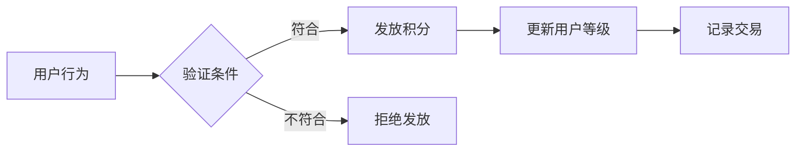
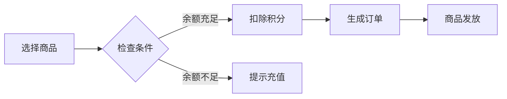
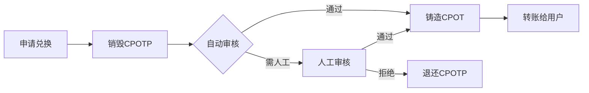

# CPOTP积分系统产品设计方案

## 项目概述

CPOTP积分系统是一个基于Web3技术的全场景积分生态，旨在打造用户友好的积分获取、消费和价值转换平台。系统采用创新的账户抽象技术，为用户提供类似Web2的丝滑体验，同时保持Web3的去中心化优势。

## 🎯 产品定位

### 核心价值主张
- **零门槛Web3体验**：用户无需理解钱包、私钥等复杂概念
- **完整积分生态**：从获取到消费的全场景覆盖
- **真实价值转换**：积分可转换为真金白银，不是空气
- **传统消费场景**：支持MasterCard日常消费，打通线上线下

## 🏗️ 系统架构

### 整体架构图

```
┌─────────────────┐    ┌─────────────────┐    ┌─────────────────┐    ┌─────────────────┐
│   APP用户界面    │    │   积分获取系统   │    │   链下商城系统   │    │   U卡充值系统   │
└─────────────────┘    └─────────────────┘    └─────────────────┘    └─────────────────┘
         │                       │                       │                       │
         └───────────────────────┼───────────────────────┼───────────────────────┘
                                 │                       │
         ┌─────────────────────────────────────────────┐ │
         │              CPOTP核心层                    │ │
         │  ┌─────────────┐  ┌─────────────┐  ┌────────┐ │ │
         │  │CPOTPToken   │  │AAWallet     │  │Paymaster│ │ │
         │  │积分代币      │  │账户抽象      │  │Gas代付  │ │ │
         │  └─────────────┘  └─────────────┘  └────────┘ │ │
         └─────────────────────────────────────────────┘ │
                                 │                       │
         ┌───────────────────────────────────────────────────────────────────────┐ │
         │                           应用层合约                              │ │
         │  ┌─────────┐  ┌─────────┐  ┌─────────┐  ┌─────────┐  ┌─────────────┐  │ │
         │  │Activity │  │Consumer │  │Recharge │  │UCardRec │  │Exchange     │  │ │
         │  │任务活动  │  │积分消费  │  │积分充值  │  │U卡记录  │  │CPOT兑换     │  │ │
         │  └─────────┘  └─────────┘  └─────────┘  └─────────┘  └─────────────┘  │ │
         └───────────────────────────────────────────────────────────────────────┘ │
                                 │                       │
         ┌─────────────────────────────────────────────┐ │
         │              链下服务层                      │ │
         │  ┌─────────┐  ┌─────────┐  ┌─────────────┐  │ │
         │  │商品管理  │  │订单处理  │  │物流服务     │  │ │
         │  │服务     │  │服务     │  │             │  │ │
         │  └─────────┘  └─────────┘  └─────────────┘  │ │
         └─────────────────────────────────────────────┘ │
                                 │                       │
         ┌─────────────────────────────────────────────────────────────────────┐
         │                      金融服务层                                      │
         │  ┌─────────────┐  ┌─────────────┐  ┌─────────────┐  ┌─────────────┐  │
         │  │U卡管理系统  │  │支付网关     │  │风控系统     │  │清算系统     │  │
         │  │(MasterCard) │  │服务        │  │             │  │             │  │
         │  └─────────────┘  └─────────────┘  └─────────────┘  └─────────────┘  │
         └─────────────────────────────────────────────────────────────────────┘
                                 │
                    ┌─────────────────┐
                    │   CPOT代币      │
                    │  (HZToken.sol)  │
                    │   外部流通       │
                    └─────────────────┘
```

### 双代币体系设计

```
┌─────────────────┐     ┌─────────────────┐
│      CPOT       │────▶│     CPOTP       │
│   (外部代币)     │     │   (内部积分)     │
│                 │◀────│                 │
│ • 可自由交易     │     │ • 仅内部流通     │
│ • 在交易所买卖   │     │ • APP内消费      │
│ • 有投资价值     │     │ • 用户获得奖励   │
└─────────────────┘     └─────────────────┘
```

### 系统分层架构

#### 核心层 (CPOTP Core)
- **CPOTPToken**: 积分代币合约，轻量化ERC20实现
- **CPOTPAAWallet**: 账户抽象钱包，支持社交恢复
- **CPOTPPaymaster**: Gas费代付系统

#### 应用层 (Application Layer)  
- **CPOTPActivity**: 任务活动系统，处理积分获取
- **CPOTPConsumer**: 通用积分消费合约
- **CPOTPRecharge**: CPOT充值系统，处理代币转换
- **CPOTPUCardRecords**: U卡记录系统，处理所有U卡相关记录上链
- **CPOTPExchange**: CPOT兑换系统，处理提现申请

#### 服务层 (Service Layer)
- **链下服务层**: 商品管理、订单处理、物流服务
- **金融服务层**: U卡管理、支付网关、风控系统、清算系统

### 核心设计原则

#### 1. 内外分离
- CPOTP专注于APP内积分经济
- CPOT面向外部价值交换
- 通过审核机制连接两个体系

#### 2. 用户体验优先
- 账户抽象消除私钥管理复杂性
- Gas代付降低使用门槛
- 批量操作提升效率

#### 3. 安全可控
- 多级权限管理
- 白名单转账限制
- 社交恢复机制
- 每日消费限额

#### 4. 可扩展性
- 模块化合约设计
- 可升级合约架构
- 灵活的插件机制

#### 5. 透明可追溯
- 所有U卡交易记录完全上链
- 敏感信息加密存储保护隐私
- 支持完整的交易历史查询
- 内置AML监控满足合规要求
- 数据完整性和防篡改保证

**设计理念**：
- CPOT作为对外价值载体，可在交易所交易
- CPOTP作为内部积分，确保用户留存和活跃
- 双向转换机制，满足不同用户需求

## 🔥 核心功能

### 1. 账户抽象技术优势

#### 传统Web3 vs 我们的方案

| 对比维度 | 传统Web3钱包 | CPOTP账户抽象 |
|---------|-------------|--------------|
| **用户门槛** | 需要理解私钥、助记词 | 手机号/邮箱即可注册 |
| **Gas费用** | 用户需要持有ETH | 系统代付，用积分抵扣 |
| **账户恢复** | 丢失助记词=永久丢失 | 社交恢复，联系客服找回 |
| **操作复杂度** | 每次操作都要签名确认 | 批量操作，一次确认多个动作 |
| **用户体验** | 等待区块确认 | 链下预处理，即时响应 |

#### 实际用户体验
```
传统方式：
1. 下载MetaMask → 2. 创建钱包 → 3. 备份助记词 → 4. 购买ETH → 5. 连接DApp → 6. 签名交易 → 7. 等待确认

我们的方式：
1. 手机号注册 → 2. 开始使用 ✅
```

### 2. 积分获取体系

#### 免费获取渠道
- **每日签到**：基础积分保障，连续签到奖励递增
- **任务系统**：新手任务、日常任务、特殊活动任务
- **推荐奖励**：邀请好友获得双方奖励
- **社区活动**：参与官方活动获得限时奖励

#### CPOT充值获取 (Recharge模块)
- **基础兑换**：1 CPOT = 1000 CPOTP (1:1000比例)
- **充值门槛**：最小充值100 CPOT起充
- **充值费用**：无手续费，鼓励用户参与
- **处理时效**：实时到账，无需等待确认
- **安全控制**：
  - 每日限额：单用户最大充值100,000 CPOT/日
  - 总量控制：系统设置充值总量上限
  - 紧急暂停：管理员可暂停充值功能
  - 白名单验证：仅允许合规用户参与充值

**充值技术实现流程**：
```
1. 用户授权CPOT → Recharge合约
2. 调用充值接口，指定充值数量
3. 验证CPOT余额和授权额度
4. 从用户账户转移CPOT到合约
5. 销毁接收到的CPOT代币
6. 按1:1000比例铸造CPOTP积分到用户账户
7. 触发充值成功事件
8. 更新用户积分余额和等级
```

**充值示例**：
```
用户充值100 CPOT：
• 基础获得：100,000 CPOTP (1:1000)
• 处理费用：0 CPOT (免费)
• 总计：100,000 CPOTP

用户充值1,000 CPOT：
• 基础获得：1,000,000 CPOTP (1:1000)
• 处理费用：0 CPOT (免费)
• 总计：1,000,000 CPOTP
```

### 3. 消费场景矩阵

#### 线上消费
- **积分商城**：实物商品、虚拟道具、会员权益
- **付费服务**：高级功能解锁、专属内容访问
- **Gas费代付**：所有区块链操作费用用积分支付

#### 线下消费 - U卡系统
- **MasterCard虚拟卡**：积分充值后全球通用
- **实体卡支持**：可申请实体卡片
- **实时消费**：超市、餐厅、加油站等日常消费
- **消费记录**：完整的消费历史追踪

**U卡使用流程**：
```
1. 用户在APP内申请U卡
2. 用积分充值到U卡（实时汇率转换为美元）
3. 获得MasterCard卡号
4. 在任何支持MasterCard的地方消费
5. 消费从卡余额扣除，无需额外手续费
```

### 4. 用户成长体系

#### 等级系统
- **等级范围**：1-100级
- **升级条件**：基于累计获得积分
- **等级权益**：
  - 充值奖励加成
  - 专属商品访问权
  - 客服优先响应
  - 特殊活动邀请

#### VIP系统
- **获得方式**：充值达到一定金额或特殊活动
- **VIP特权**：
  - 所有充值额外5%奖励
  - VIP专属商品
  - 专属客服通道
  - 提前体验新功能


---

## 🎯 结论

CPOTP积分系统通过创新的账户抽象技术，解决了Web3产品用户体验差的核心痛点。完整的双代币体系设计既保证了用户留存，又提供了真实的价值转换通道。特别是U卡系统的创新，将数字积分与传统消费场景无缝连接，为用户创造了真正的使用价值。

在正确的产品策略和技术实现的支撑下，我们有信心打造出下一代积分系统的标杆产品，引领行业向更好的用户体验方向发展。

---

## 💳 U卡记录上链系统

### 系统概述

U卡记录上链系统是CPOTP积分系统的重要组成部分，负责将所有U卡相关的交易记录、余额变动、充值提现等操作记录到区块链上，确保交易的透明性、可追溯性和不可篡改性。

### 核心功能

#### 记录类型
- **充值记录**: 从CPOTP积分充值到U卡的所有记录
- **消费记录**: U卡在各种场景下的消费记录
- **提现记录**: 从U卡余额提现到其他账户的记录
- **余额变动记录**: 所有影响U卡余额的操作的综合记录

### 数据结构设计

#### 充值记录结构
```solidity
struct TopUpRecord {
    bytes32 recordId;           // 唯一记录ID
    address user;               // 用户地址
    string cardId;              // U卡ID（加密存储）
    uint256 cpotpAmount;        // 消耗的CPOTP积分数量
    uint256 fiatAmount;         // 充值的法币金额（以美分为单位）
    uint256 exchangeRate;       // 汇率（CPOTP:USD）
    uint256 timestamp;          // 充值时间戳
    RecordStatus status;        // 记录状态
    bytes32 transactionHash;    // 金融服务交易哈希
}
```

#### 消费记录结构
```solidity
struct SpendRecord {
    bytes32 recordId;           // 唯一记录ID
    string cardId;              // U卡ID（加密存储）
    uint256 amount;             // 消费金额（美分）
    bytes32 merchantHash;       // 商户信息哈希（隐私保护）
    SpendCategory category;     // 消费类型
    uint256 timestamp;          // 消费时间戳
    RecordStatus status;        // 记录状态
    bytes32 settlementHash;     // 清算哈希
}
```

#### 提现记录结构
```solidity
struct WithdrawRecord {
    bytes32 recordId;           // 唯一记录ID
    string cardId;              // U卡ID（加密存储）
    uint256 amount;             // 提现金额（美分）
    uint256 fee;                // 手续费（美分）
    bytes32 targetAccountHash;  // 目标账户哈希（隐私保护）
    uint256 timestamp;          // 提现时间戳
    RecordStatus status;        // 记录状态
    bytes32 transactionHash;    // 外部交易哈希
}
```

#### 余额变动记录结构
```solidity
struct BalanceChangeRecord {
    bytes32 recordId;           // 唯一记录ID
    string cardId;              // U卡ID（加密存储）
    int256 deltaAmount;         // 余额变动（正数为增加，负数为减少）
    uint256 balanceAfter;       // 变动后余额
    ChangeReason reason;        // 变动原因
    bytes32 relatedRecordId;    // 关联的记录ID
    uint256 timestamp;          // 时间戳
}
```

### 枚举类型定义

#### 记录状态
```solidity
enum RecordStatus {
    PENDING,    // 待处理
    SUCCESS,    // 成功
    FAILED,     // 失败
    CANCELLED   // 已取消
}
```

#### 消费类型
```solidity
enum SpendCategory {
    ONLINE,         // 线上消费
    OFFLINE,        // 线下消费
    SUBSCRIPTION,   // 订阅服务
    TRANSFER,       // 转账
    REFUND,         // 退款
    OTHER           // 其他
}
```

#### 变动原因
```solidity
enum ChangeReason {
    TOPUP,      // 充值
    SPEND,      // 消费
    WITHDRAW,   // 提现
    FEE,        // 手续费
    REFUND,     // 退款
    ADJUSTMENT  // 调整
}
```

### 核心功能接口

#### 记录功能
```solidity
// 记录充值操作
function recordTopUp(
    address user,
    string memory cardId,
    uint256 cpotpAmount,
    uint256 fiatAmount,
    uint256 exchangeRate
) external onlyAuthorized returns (bytes32 recordId);

// 记录消费操作
function recordSpend(
    string memory cardId,
    uint256 amount,
    bytes32 merchantHash,
    SpendCategory category
) external onlyAuthorized returns (bytes32 recordId);

// 记录提现操作
function recordWithdraw(
    string memory cardId,
    uint256 amount,
    uint256 fee,
    bytes32 targetAccountHash
) external onlyAuthorized returns (bytes32 recordId);

// 批量记录操作（Gas优化）
function batchRecordOperations(
    RecordType[] memory types,
    bytes[] memory data
) external onlyAuthorized;
```

#### 查询功能
```solidity
// 查询用户的所有充值记录
function getUserTopUpRecords(
    address user,
    uint256 fromTimestamp,
    uint256 toTimestamp
) external view returns (TopUpRecord[] memory);

// 查询指定U卡的消费记录
function getCardSpendRecords(
    string memory cardId,
    uint256 fromTimestamp,
    uint256 toTimestamp
) external view returns (SpendRecord[] memory);

// 查询余额变动历史
function getBalanceHistory(
    string memory cardId,
    uint256 fromTimestamp,
    uint256 toTimestamp
) external view returns (BalanceChangeRecord[] memory);
```

### 隐私保护机制

#### 数据加密
- **卡号加密**: U卡ID使用AES-256加密存储
- **商户信息哈希**: 商户详细信息通过SHA-256哈希保护
- **目标账户哈希**: 提现目标账户信息哈希处理

#### 访问控制
```solidity
// 基于角色的访问控制
modifier onlyAuthorized() {
    require(
        hasRole(RECORDER_ROLE, msg.sender) ||
        hasRole(ADMIN_ROLE, msg.sender),
        "Unauthorized access"
    );
    _;
}

// 用户隐私保护
modifier onlyOwnerOrAuthorized(string memory cardId) {
    require(
        isCardOwner(msg.sender, cardId) ||
        hasRole(ADMIN_ROLE, msg.sender),
        "Access denied"
    );
    _;
}
```

### 事件系统

#### 记录事件
```solidity
event TopUpRecorded(
    bytes32 indexed recordId,
    address indexed user,
    uint256 cpotpAmount,
    uint256 fiatAmount,
    uint256 timestamp
);

event SpendRecorded(
    bytes32 indexed recordId,
    bytes32 indexed cardHash,
    uint256 amount,
    SpendCategory category,
    uint256 timestamp
);

event WithdrawRecorded(
    bytes32 indexed recordId,
    bytes32 indexed cardHash,
    uint256 amount,
    uint256 fee,
    uint256 timestamp
);

event BalanceChanged(
    bytes32 indexed recordId,
    bytes32 indexed cardHash,
    int256 deltaAmount,
    uint256 balanceAfter,
    ChangeReason reason,
    uint256 timestamp
);
```

### Gas优化策略

#### 批量操作
- 支持批量记录多个交易，减少Gas消耗
- 使用事件日志存储详细信息，链上只存储关键数据

#### 存储优化
- 使用packed structs减少存储槽使用
- 关键数据上链，详细信息通过IPFS存储
- 实现数据归档机制，定期清理历史数据

#### 分层存储
```solidity
// 热数据（最近30天）：链上存储
mapping(bytes32 => Record) public hotRecords;

// 温数据（30-90天）：压缩存储
mapping(bytes32 => bytes) public warmRecords;

// 冷数据（90天以上）：IPFS存储
mapping(bytes32 => string) public coldRecordsIPFS;
```

### 合规性设计

#### 监管报告
- 支持生成合规报告，满足金融监管要求
- 实现反洗钱(AML)监控，异常交易自动标记
- 支持数据导出，配合审计和调查

#### 数据保留
- 根据法规要求，保留交易记录至少7年
- 实现数据备份和恢复机制
- 支持数据删除（在法律允许的情况下）

### 与其他模块集成

#### 与Consumer模块集成
```solidity
// U卡消费时同时记录
function consumeWithUCard(
    string memory cardId,
    uint256 amount,
    bytes32 merchantHash
) external {
    // 执行消费逻辑
    _consumePoints(amount);
    
    // 记录消费信息
    uCardRecords.recordSpend(cardId, amount, merchantHash, SpendCategory.OFFLINE);
}
```

#### 与金融服务层集成
- 接收金融服务层的交易确认
- 更新记录状态（成功/失败）
- 处理退款和调整操作

### 安全考虑

#### 数据完整性
- 使用Merkle树验证批量操作的完整性
- 实现记录的数字签名验证
- 定期执行数据一致性检查

#### 防篡改机制
- 所有记录一旦创建不可修改，只能更新状态
- 实现记录链，前一个记录的哈希包含在后一个记录中
- 使用时间戳防止重放攻击

---

## 🔧 技术特性详解

### EIP-4337 账户抽象
- **EntryPoint**: 统一的入口合约，处理所有用户操作
- **UserOperation**: 用户操作的标准化数据结构
- **Paymaster**: 支持积分支付Gas费，提升用户体验
- **Bundler**: 批量处理用户操作，优化网络效率

### 智能合约架构
- **可升级设计**: 基于OpenZeppelin的UUPS代理模式
- **权限管理**: 基于角色的访问控制(RBAC)
- **模块化设计**: 各模块独立部署，职责清晰
- **事件驱动**: 完整的事件体系，支持链下监控

### 积分经济模型
- **多源获取**: 支持6种不同的积分获取方式
- **动态奖励**: 基于用户等级和活动的奖励倍数
- **消费场景**: 商城购物、Gas费支付、特权服务
- **通胀控制**: 每日获取限额，防止积分通胀

## 📋 完整业务流程

### 积分获取流程

#### 免费获取流程图


#### CPOT充值获取流程
```
用户持有CPOT → 申请充值兑换 → 销毁CPOT代币 → 铸造CPOTP积分 → 立即可用消费
```

### 积分消费流程

#### 线上消费流程图  


#### 线上消费详细流程
```
用户选择商品(链下) → 检查库存余额(混合) → 创建订单(链下) → 销毁积分(链上) → 履约发货(链下)
```

#### U卡充值消费流程
```
积分充值到U卡(链上) → 记录充值信息(链上) → 生成虚拟卡余额(金融服务) → 日常刷卡消费(传统支付) → 记录消费信息(链上) → 定期清算对账(链下)
```

### 兑换提现流程

#### 兑换流程图


#### 兑换流程详细说明
```
申请兑换 → 销毁CPOTP → 多级审核 → 铸造CPOT → 转账到用户钱包
```

## 🛡️ 安全机制详解

### 智能合约安全
- **重入攻击防护**: 使用ReentrancyGuard修饰符
- **溢出保护**: 使用SafeMath或Solidity 0.8+内置保护
- **权限校验**: 严格的角色和权限检查
- **输入验证**: 所有外部输入都进行验证

### 业务安全
- **白名单机制**: CPOTP只能在授权合约间转移
- **每日限额**: 防止积分异常获取和消费
- **审核机制**: 大额兑换需要人工审核
- **暂停功能**: 紧急情况下可暂停系统

### U卡记录安全
- **数据加密**: U卡ID和敏感信息使用AES-256加密存储
- **访问控制**: 基于角色的权限管理，用户只能访问自己的记录
- **隐私保护**: 商户信息和账户信息通过哈希处理
- **数据完整性**: 使用Merkle树和数字签名验证记录完整性
- **防篡改**: 记录一旦创建不可修改，只能更新状态
- **合规监控**: 实现AML监控，异常交易自动标记

## 🔗 与现有系统集成

### HZToken集成点
- **兑换桥接**: CPOTP → CPOT的转换机制
- **审核系统**: 利用HZToken的权限管理
- **安全机制**: 复用黑名单、暂停等功能

### 部署策略
1. **阶段一**: 部署核心CPOTP合约和CPOTPConsumer
2. **阶段二**: 集成账户抽象功能和Gas代付
3. **阶段三**: 部署U卡记录系统和链下商城服务
4. **阶段四**: 上线完整的活动系统和积分获取功能
5. **阶段五**: 开启CPOT兑换功能和完整生态运行


---

**注意**: 本系统目前处于开发阶段，请在生产环境使用前进行充分测试和安全审计。

这个完整的产品设计确保了CPOTP积分系统的完整性、安全性和可扩展性，为用户提供优质的Web3积分体验。